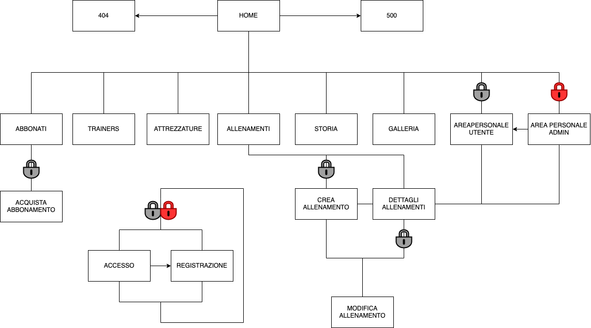
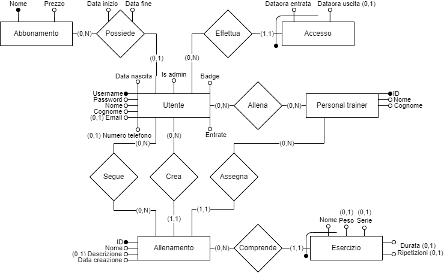
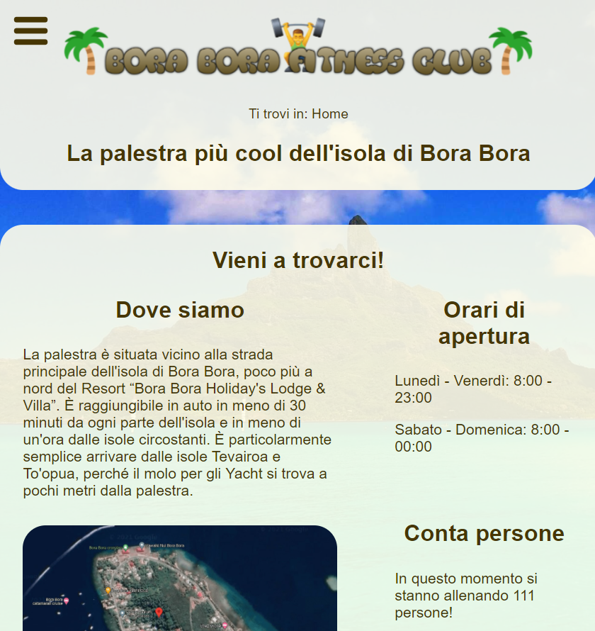
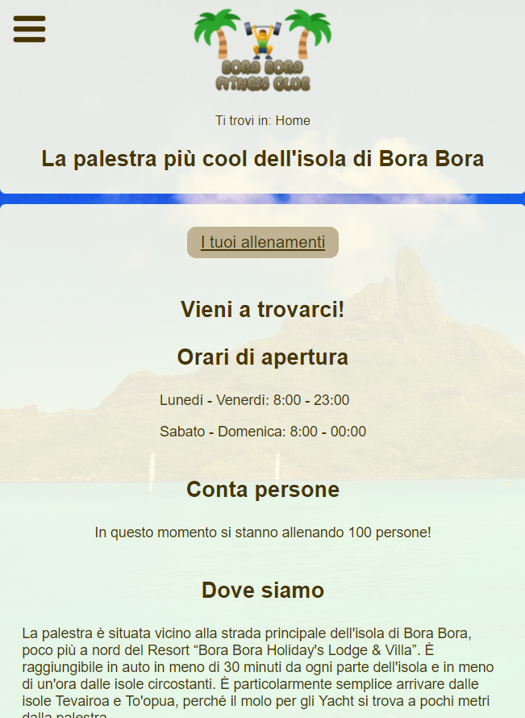

# BoraBoraFitnessClub
The goal of this Web Technologies project was to create a website for a gym. 
 
 
_Note: The website is in italian, so all the following schemas will be in italian_

## Visit the website ##
Visit the website on <a href="https://boraborafc.000webhostapp.com/">boraborafc.000webhostapp.com</a>.

## Sitemap ##
 

* **Home**: This page shows the most important information about the gym and has a section where is describe why a person should subscribe to the gym
* **Abbonati**: In this page are listed all the subscription option. There is also a link to buy a subscription
* **Acquista abbonamento**: This page is accessible only to the authenticate users. In this page you can actual buy a subscription
* **Trainers**: In this page are listed all the gym's trainers
* **Attrezzature**: In this page are listed all the gym equipment
* **Allenamenti**: This pages shows all the trainings created by the users
* **Crea allenamento**: This page is accessible only to the authenticate users. In this page you can create your training. 
* **Dettagli allenamento**: In this page you can find all the details about a particular training
* **Modifica allenamento**: In this page you can modify a training
* **Storia**: This page tell the story of the gym
* **Galleria**: In this page you can find the photos of the gym 
* **Area personale utente**: This page is accessible only to the authenticate users. In this page you can find all the user's information
* **Area personale admin**: This page is accessible only to the admin. This is an administration page
* **Accesso**: This is the authentication page
* **Registrazione**: This is the registration page
* **404**: Error 404 page
* **500**: Error 500 page

## Database ##
 
_Note: The database is in Boyce-Codd Normal Form_

## Accessibility ##
This website meets the [WCAG 2.0](https://www.w3.org/TR/WCAG20/) standard.

# Gallery #
## Desktop ##
 

## Tablet ##
 

## Mobile ##
 
